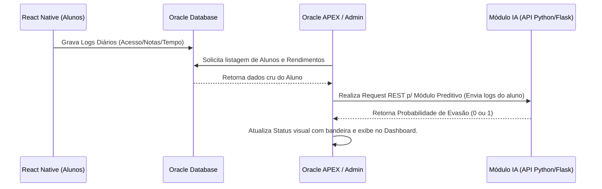

# Documentação Técnica: IA - Predição de Evasão (Challenge IoT/Oracle)

Este repositório contém a documentação técnica e o código-fonte (mock) referentes ao desenvolvimento e integração da Inteligência Artificial em nosso projeto.

## 1. Definição do Problema de IA dentro do APEX
**Problema:** Alta taxa de desistência (evasão Escolar) de alunos em cursos focados em nossa plataforma de ensino mobile.
**Uso na Aplicação APEX:** 
A nossa aplicação APEX consumirá nosso banco de dados relacional para prover dashboards à coordenação acadêmica. O módulo de Inteligência Artificial processará dados de estudo em tempo real, avaliando as notas, acessos e dias inativos, marcando os alunos com alto risco de abandono (Flags no dashboard). Isso permitirá ações preventivas rápidas por parte dos tutores (ex: envio de vouchers, mensagens personalizadas de incentivo).

## 2. Escolha do Modelo de IA
O modelo escolhido foi o **Random Forest Classifier** (via Scikit-Learn).
**Justificativa:**
- Nosso problema é de Classificação (O aluno vai desistir? Sim/Não).
- Modelos complexos de *Deep Learning* ou *LLM* demandam alto processamento e, neste caso específico (dados tabulares de logs comportamentais), o Random Forest entrega alta interpretabilidade e acurácia. O Random Forest suporta bem *outliers* de acessos e cria uma floresta de decisões que simula uma coordenação decidindo por que o aluno pode desistir (ex: "Se inativo a mais de 15 dias e com nota baixa").

## 3. Dados Alimentados à IA
Os dados necessários foram mapeados dos logs coletados no Banco de Dados Oracle.
- **Origem dos Dados:** Base do aplicativo principal em **React Native** consumida pela nossa API e gravada num schema do *Oracle Database*.
- **Formato:** Dados estruturados (Colunas relacionais e Datasets tabulares).
- **Atributos Chave:** `horas_estudadas`, `exercicios_concluidos`, `media_notas`, `dias_inativos`.
- **Quantidade Necessária:** O modelo requer um histórico de, no mínimo, 5.000 a 10.000 registros para garantir uma generalização acurada em produção.

## 4. Diagrama de Comunicação com Oracle Database e APEX
No cenário proposto de arquitetura, este será o mapeamento e comunicação da plataforma:



## 5. Fluxo de Funcionamento (Quando o Usuário Aciona a Funcionalidade)
1. O administrador acessa sua tela do **Oracle APEX** e carrega o painel principal da plataforma.
2. Atrás dos panos, o APEX executa uma macro (via REST Data Sources ou chamadas PL/SQL) disparando uma requisição aos servidores Python rodando a IA.
3. O servidor Python retorna uma matriz de previsões (ex: Aluno X tem 80% de chance de desistir).
4. O frontend do APEX renderiza alunos em vermelho de maneira dinâmica no grid relacional.

---

## 🛠️ Instruções de Uso (Demonstração Local - MVP Simulado)

Conforme orientação acadêmica, para esta entrega isolamos a demonstração da IA de seu acoplamento ao APEX para testar apenas o funcionamento analítico da solução. Substituímos momentaneamente a camada do *Oracle APEX* por um painel mock interativo escrito em Python (**Streamlit**) para o roteiro do Pitch.

### Passos de Instalação e Execução
1. Abra um terminal na pasta do projeto.
2. Instale as dependências executando:
   ```bash
   pip install -r requirements.txt
   ```
3. Treine e gere o modelo falso digitando o comando:
   ```bash
   python train_model.py
   ```
   *(Isso irá simular registros de alunos e criar o arquivo `modelo_evasao.pkl`).*
4. Inicie o dashboard administrativo falso simulando o painel APEX:
   ```bash
   python -m streamlit run app.py ou streamlit run app.py
   ```
5. Acesse seu navegador local na porta recomendada e teste o modelo de Evasão.
